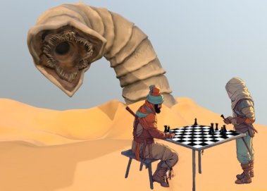

    Preview do Podcast

    <audio src="output/podcast_editado.MP3" controls title="Podcast editado"></audio>

# Areias e Engrenagens: Permacultura e Engenharia no Tabuleiro do Deserto

 > ℹ️ **NOTE:** Este é o repositório desenvolvido atraveis do desafio proposto com a [DIO](https://dio.me)

Projeto com o objetivo de gerar um podcast utilizando ferramentas de IA através de prompts elaborados para criar um conteúdo rico e interessante.

## 💻 Tecnologias utilizadas no projeto

- [ChatGPT](https://chat.openai.com/) - para criação de roteiro
- [Lexica.art](https://lexica.art) - para geração de capas
- [ElevenLabs](https://beta.elevenlabs.io/) - para síntese de voz
- [Capcut](https://www.capcut.com/pt-br/) - para edição de áudio
- [SoundCloud](https://soundcloud.com/) - para subir o audio na web

## ✨ Como foi feito?

- Roteiro gerado via ChatGPT
- Áudio gerado pela ElevenLabs
- Imagens geradas pela Lexica.art
- Capcut para tratar o áudio e adicionar sons de fundo
- SoundClound para armazenar e disponibilizar o podcast

## 📚 Materiais

- [Notion Template](https://helpful-jump-17b.notion.site/PAS-Podcast-AI-Studio-210489e15d7a4a73b743bb159e45d06f?pvs=4)
- [Editor de áudio](https://www.capcut.com/editor?from_page=landing_page&__action_from=picture_V%C3%ADdeos%20profissionais%20em%20minutos,%20n%C3%A3o%20em%20horas.)

## 🛠️ Instruções de execução

Utilize os prompts dentro do link do `Notion` fornecido na parte de `Materiais` para criar um podcast de maneira automatizada. Para isso, siga o passo a passo abaixo:

1. 🤖 Use os prompts de roteiro no `ChatGPT`
2. 🤖 Use os roteiros gerados pelo ChatGPT no `ElevenLabs`
3. 🤖 Use as imagens disponiveis na plataforma da 'lexica.art'
4. 🛠 Edite o áudio e adicione sons de fundo no `Capcut`
5.   Suba os arquivos na plataforma da Souncloud

## 👨‍💻 Desenvolvedor

    
    
&nbsp&nbsp&nbspKeven Santos 
    &nbsp&nbsp&nbsp
    <a 
        href="https://github.com/kkee95">
        GitHub
    </a>
    &nbsp;|&nbsp;
    <a 
        href="https://www.linkedin.com/in/keven-santos-384353268/">
        LinkedIn
    </a>
    &nbsp;|&nbsp;
    <a 
        href="https://www.instagram.com/kevensantuz/">
        Instagram
    </a>
    &nbsp;|&nbsp;

  

---

⌨️ com 💜 por [Keven Santos](https://github.com/kkee95)
