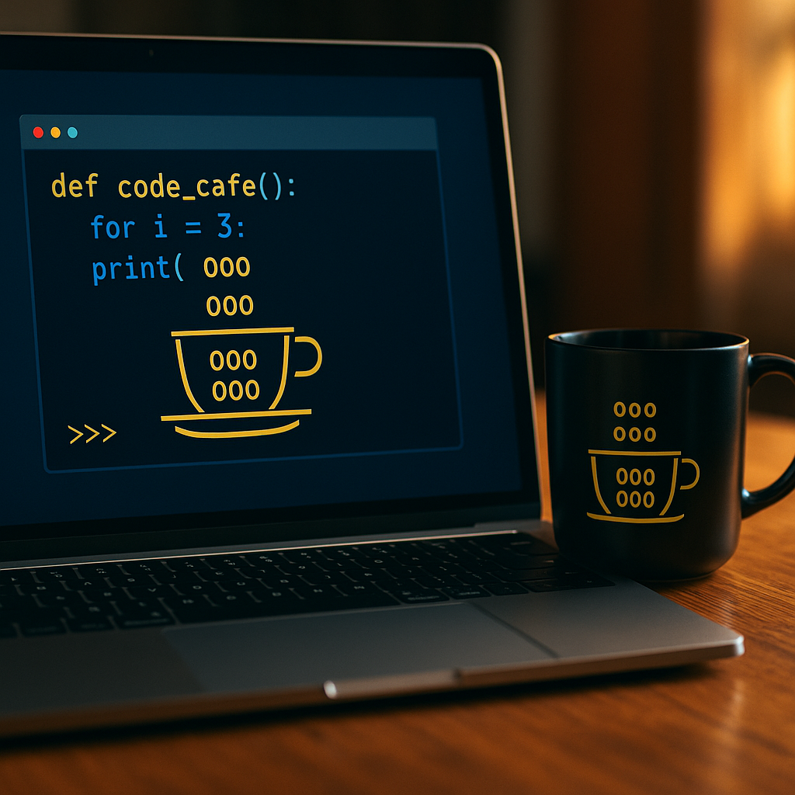
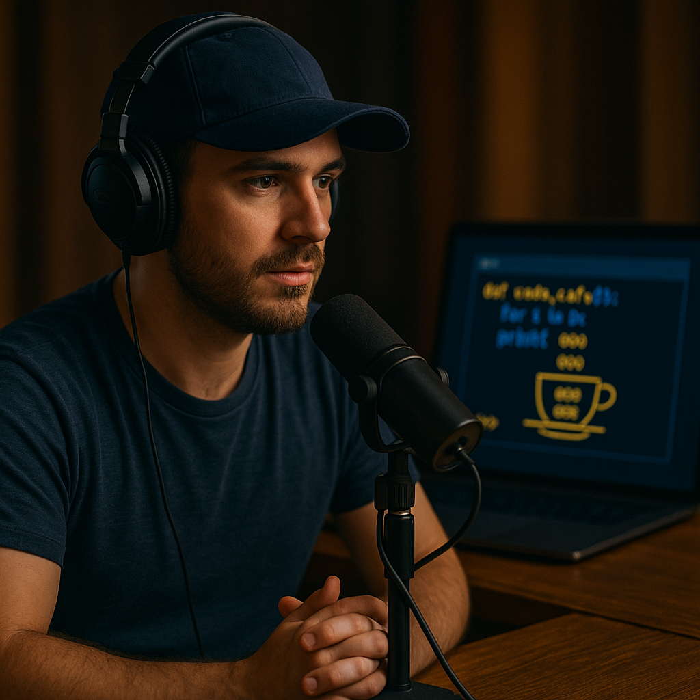

# Criação das Mídias

Todo o processo criativo das imagens fiz juntamente com o chatGPT como uma equipe de criação. Interessante que o próprio chatGPT se ofereceu para gerar as imagens.
Reposta:
"Se quiser, posso gerar as imagens de capa e logo em estilo MidJourney, ou criar um documento markdown separado com o roteiro do episódio piloto. É só dizer!"

Entretanto, continuei a conversa para o processo criativo com o seguinte prompt:

```prompt
Agora estou pensando na Logo do podcast.
Pensei em usar as mesmas cores relacionadas ao python (azul e amarelo).
Mas tem que ter haver com Código e Café, Me faça a descrição
de 5 sugestões de Logo para representar o Podcast e seu slogan: 
**Código com Café**
_“Porque toda grande mudança começa com um bom café e algumas linhas de código.”_
```

**As sugestões do chatGPT**

|   Título Logo    | Descrição Visual | Simbolismo |
| ---------------- | ---------------- | ---------- |
| ☕ 1. Xícara com Código Vapor | Uma xícara de café estilizada, de onde sobe um vapor formado por símbolos de código (como {}, </>, ou linhas de terminal >>>). O corpo da xícara pode ser azul e o vapor, em tons de amarelo claro, formando uma espiral sutil. | - Representa o calor da conversa e o despertar da mente.<br>- O código “evaporando” do café mostra que grandes ideias nascem nas pausas.<br>- A simplicidade do ícone permite fácil adaptação para favicon, thumb e redes sociais.|
| ☕ 2. Notebook com Xícara Integrada |Um notebook (laptop) aberto com uma xícara no canto inferior da tela ou como parte do teclado (como se estivesse apoiada nele). A tela do notebook pode mostrar uma tela preta com código em azul e amarelo. | - Representa o universo de estudo e criação de quem está começando.<br> - Une os dois mundos: tecnologia (código) e conforto (café).<br> - Estilo “flat design”, amigável e moderno.|
| ☕ 3. Café Pixelado | Uma xícara ou caneca pixelada (como se tivesse saído de um videogame antigo ou app retrô), com um pequeno coração flutuando como vapor, e alguns pixels se transformando em linhas de código que caem como “chuva” ao lado. | - Representa o começo humilde e lúdico.<br> - A ideia de “construção aos poucos” (como blocos ou pixels).<br> - Traz humor e nostalgia, ideal para o público que está fazendo uma transição de carreira. |
| ☕ 4. Café com Terminal |Uma caneca com o símbolo >>> (prompt do Python) impresso nela. Ao lado, um pequeno notebook ou teclado estilizado. O fundo pode ter um leve degradê azul para amarelo, formando um halo suave. | - Diretamente ligado ao Python e à ideia de terminal/interpretação.<br> - Simples, elegante, com forte referência visual ao slogan.<br> - Pode funcionar bem como ícone vetorial minimalista. |
| ☕ 5. Café com Cérebros | Um cérebro dividido em duas metades: uma formada por padrões de circuitos/código e outra com padrões fluidos como vapor de café. Abaixo, uma xícara como base, conectando ambas as partes.| - Representa lógica + criatividade = ciência de dados.<br> - A união do humano com a tecnologia, o aprendizado com o prazer.<br> - Estilo mais artístico/conceitual, ideal para destacar a originalidade do projeto. |

---
Ao final o chatGPT ainda se ofereceu para gerar a imagem.

_Se quiser, posso gerar uma dessas logos no estilo do MidJourney (com prompt pronto) ou te ajudar a criar o briefing visual completo para enviar para um designer. Tem alguma dessas que você curtiu mais?_

---

## Criação da logo do Podcast

**Prompt 1**

```prompt
A modern open laptop on a wooden desk, displaying a dark terminal window with
Python code on screen. The code is a function: "def code_cafe():" that prints
a coffee cup using 'o' characters in ASCII art. Below the function, the output
is a stylized coffee cup made with ooo letters. The cup is repeated on the mug
sitting next to the laptop, which also has the ASCII cup printed on it. Terminal
prompt shows ">>>". Colors inspired by the Python logo (blue and yellow).
Cinematic photography style with complex lighting, warm tones, realistic shadows,
and dynamic backlighting.
```

Tentei criar a imagem no Midjourney, entretanto estava exigindo que eu fizesse assinatura em algum plano da plataforma. Assim, usei o próprio chatGpt para geração das imagens. O resultado do prompt para a logo foi a seguinte:


## Criação da imagem do Podcaster

O primeiro resultado do prompt para geração da imagem do podcaster não me agradou tanto, pois queria a logo do posdcast no boné do podcaster, e o prompt inicial foi o seguinte:

```prompt
Agora vamos Tentar fazer a Imagem de um podcaster usando um boné azul escuro,
como na tela do notebook que criamos e o logo da xicara de café com o café e
a fumaça formados pela letra 'o' e primeira linha de letras 'o' com o simbolo
'>>>' para indicar o início do código e à esquerda da base da xícara com o símbolo
'>>>' para indicar o fim do código. Na frente do podcaster um microfone de mesa
e ele está usando um headset.

Com as mesmas configurações?
Mudando apenas o --ar: 9:16 (vertical)
O que acha?
```

O que gerou a seguinte imagem:


Perceba que neste momento eu utilizei a memória do chat, fazendo uso do aproveitamento de prompt, para obter uma imagem combinando o que já havia sido conversado em um prompt anterior.

COmo havia dito, não fiquei completamente satisfeito com este primeiro resultado, então refiz o prompt, especificando um pouco mais a saída desejada.

**Prompt 2**

```prompt
Agora vamos Tentar fazer a Imagem de um podcaster usando um boné azul escuro, como na
tela do notebook que criamos e o logo da xicara de café com o café e a fumaça formados
pela letra 'o' e primeira linha de letras 'o' com o simbolo '>>>' para indicar o início
do código e à esquerda da base da xícara com o símbolo '>>>' para indicar o fim do código.
Na frente do podcaster um microfone de mesa e ele está usando um headset.

Com as mesmas configurações?
Mudando apenas o --ar: 9:16 (vertical)
O que acha?
```

Perceba que nesta geração de imagem fiz o prompt em português mesmo e olha o resultado.


É um fato que a logo no boné, na tela do notebook, na camisa e até no headset não ficaram identicos ao logo esperado, mas o resultado ficou muito bom, ao meu ver, me agradou bastante.

---

Esta foi a jornada para obter as imagens do podcast Código com Café.

Fala sério, com essas artes você não está ansioso para ouvir o primeiro episódio do Código com Café?
Aguarde os próximos passos. 😜
